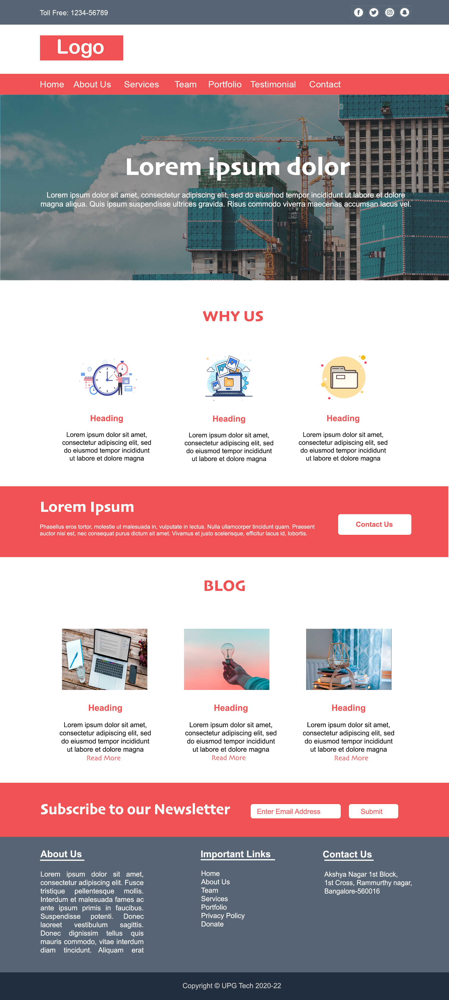

# PSD To HTML

In website development a better practice is to first create a graphical web design using image editing tools and then code the actual website.
[PSD To HTML](https://github.com/himalgnn/psd-to-html) is a similar project.

Initially a psd template of website is designed and then the HTML, CSS & JS Code is Written.

# Deployment (Must Do)
Website is only half completed so Download the website folder, open it in VSCode and use liveserver for opening the index.html and other html pages.

# Screenshot of Initial Design

